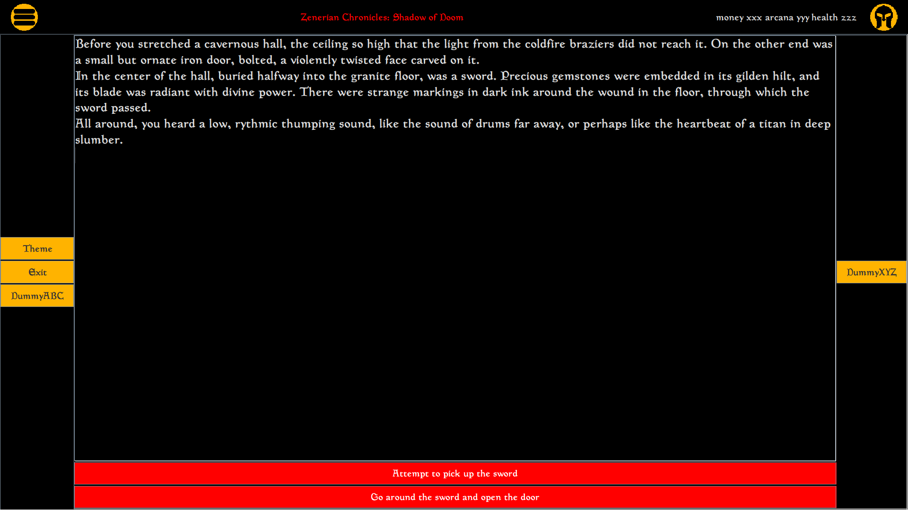

## Description
Temporary personal repo for experimenting with and learning Swing, so that I may use GUI elements in a [text game](https://github.com/Senozoid/ZenChron) (currently private) I am making.

## Structure
_(if class is not mentioned, it's homonymous)_
* mainWindow
    * topPanel
    * mainPanel
      * mainMenuPanel _(class: MenuPanel)_
      * gamePanel
        * display
          * scroller _(class: JScrollPane)_
            * textArea _(class: JTextArea)_
          * optPanel
        * gameMenuPanel _(class: MenuPanel)_

## Minor Issues
1. The game menu may open while toggling the main menu.

## Screenshots
Certain ISPs (like Jio) block _raw.githubusercontent.com_ for some reason. This causes the images to not load. \
If you have that problem, click on the alt-text to view individual images, or use a VPN to bypass the block.

